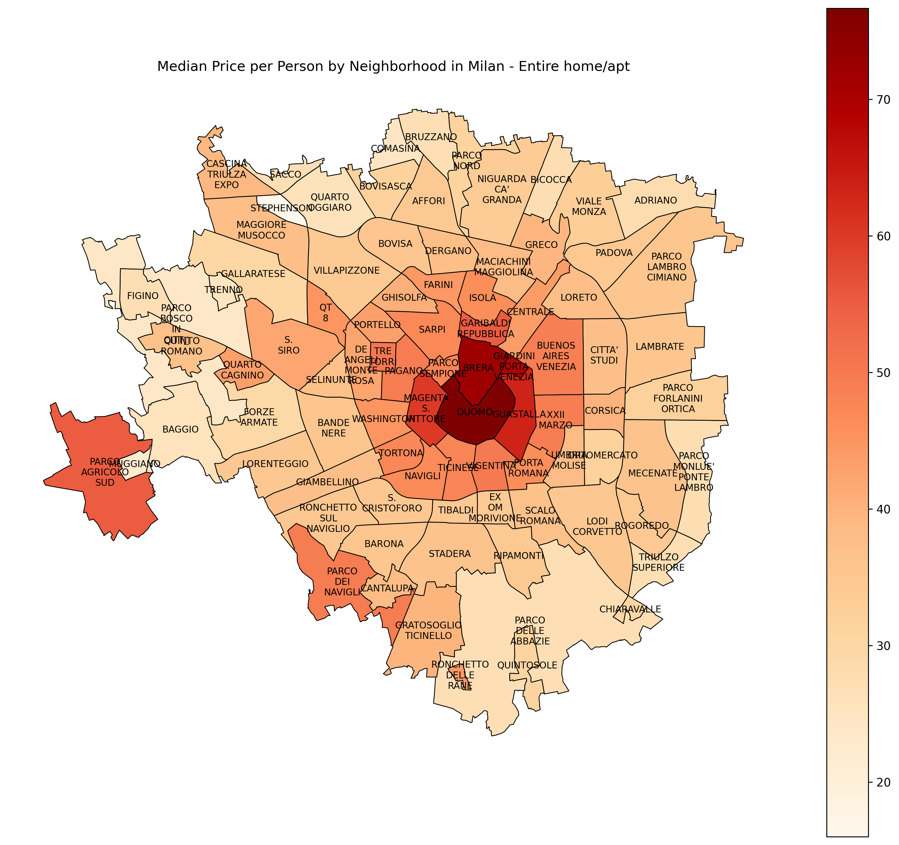
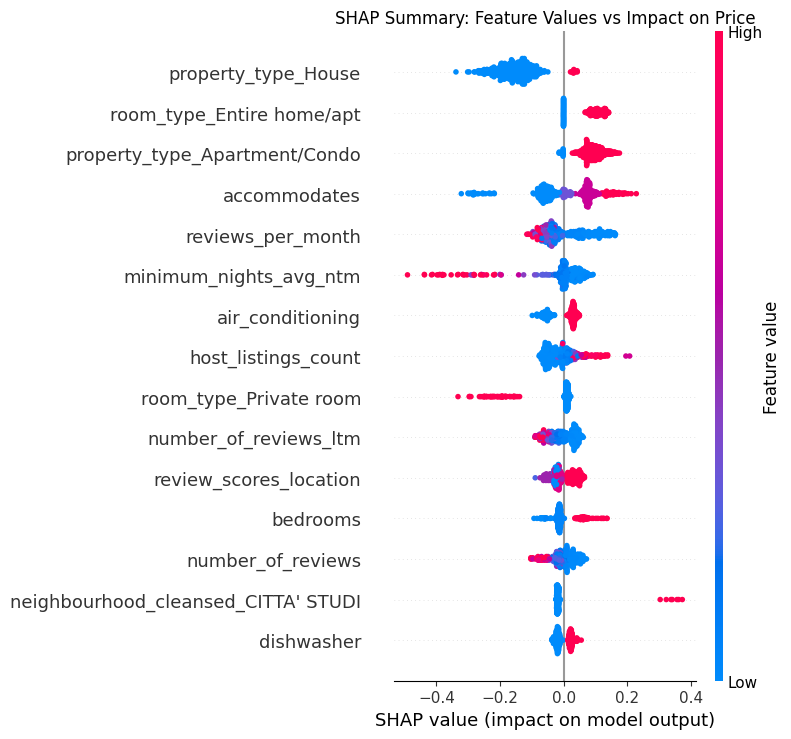

# Airbnb Price Prediction in Milan: From Raw Data to Actionable Business Intelligence

A machine learning pipeline I built to predict Airbnb listing prices in Milan, featuring geospatial analysis, nested cross-validation, and business insights. The final XGBoost model achieved R² = 0.587 with $34.51 median absolute error.



## Problem Statement

I wanted to tackle the complexity of Milan's Airbnb pricing across 88 neighborhoods with varying property types and market dynamics. My goal was building a model that could help hosts price competitively and provide investors with data-driven market insights.

## What I Built

**Nested Cross-Validation Framework**: I implemented proper model selection methodology across 11 algorithms to get unbiased performance estimates - something I learned is often overlooked in many ML projects.

**End-to-End Data Pipeline**: Built preprocessing that handles the messiness of real data - mixed data types, systematic missing values, and geographic coordinate matching with Milan's official neighborhood boundaries.

**Geographic Price Analysis**: Created visualizations showing price patterns across Milan's neighborhoods, normalizing by capacity to reveal true geographic premiums.

**Interpretable Results**: Used SHAP analysis to identify the key pricing drivers and translate technical findings into actionable business recommendations.

## Technical Approach

```
Data Science Stack: pandas, scikit-learn, XGBoost, SHAP
Geospatial Tools: GeoPandas, Shapely for coordinate-boundary matching  
Visualization: matplotlib, seaborn for analysis and presentation
Validation: Nested CV with RandomizedSearchCV for hyperparameter tuning
```

## Project Structure

```
├── notebooks/
│   ├── 01_data_loading.ipynb       # Integrated 4 Inside Airbnb datasets
│   ├── 02_preprocessing.ipynb      # Feature engineering and cleaning
│   ├── 03_EDA_price.ipynb         # Geographic price exploration
│   ├── 04_modeling.ipynb          # Model selection with nested CV
│   └── 05_interpretability.ipynb  # SHAP analysis and insights
├── data/
│   ├── raw/                       # Original Inside Airbnb files
│   └── interim/                   # Processed datasets
├── figures/                       # Maps and visualizations I generated
└── src/                          # Reusable preprocessing functions
```

## Data Challenges I Solved

**Multi-Source Integration**: Combined listings (23,705 properties), calendar data (8.6M records), reviews (868K), and geospatial boundaries into a unified dataset.

**Missing Value Strategy**: Discovered that review score missingness wasn't random - it indicated new listings without reviews yet. I handled this by creating "no_reviews" categories rather than imputing fake values.

**Text Feature Engineering**: Parsed amenity descriptions to extract structured features like air conditioning, parking, and wifi quality using regex patterns.

**Geographic Matching**: Performed spatial joins between listing coordinates and Milan's neighborhood polygons, handling coordinate reference system transformations.

## My Feature Engineering Process

```python
# Example: Converting messy amenity text into structured features
amenity_mapping = {
    'air_conditioning': 'Air conditioning|Central air conditioning|Portable air conditioning',
    'parking': 'parking',  
    'fast_wifi': 'Fast wifi|Ethernet connection'
}

# Created categorical variables for review patterns
review_categories = ["no_reviews", "low_reviews", "medium_reviews", "high_reviews", "top_reviews"]

# Engineered temporal features from review dates
days_since_first_review = (last_scraped - first_review).dt.days
```

I built separate preprocessing pipelines for different data types:
- StandardScaler for numerical features (accommodates, bathrooms, etc.)
- OneHotEncoder for categorical features (neighborhoods, property types)
- OrdinalEncoder for ordered categories (review quality levels)

## Model Selection Results

I compared 11 different algorithms using nested cross-validation to get honest performance estimates:

| Model | Mean R² | Std R² | Notes |
|-------|---------|--------|-------|
| **XGBoost** | **0.564** | 0.015 | Best performer, selected for final model |
| CatBoost | 0.557 | 0.016 | Close second, good handling of categoricals |
| GradientBoosting | 0.544 | 0.016 | Solid ensemble performance |
| RandomForest | 0.500 | 0.018 | Good baseline, less overfitting |
| Ridge Regression | 0.416 | 0.019 | Best linear model |

The nested CV approach gave me confidence these results would generalize - and indeed, my final test set R² of 0.587 exceeded the cross-validation estimate.

## Geographic Insights I Discovered

I created price-per-person maps that revealed Milan's pricing geography:

**Premium Areas**: Central districts like Duomo and Brera command 40%+ premiums over the city average.

**Value Opportunities**: Peripheral neighborhoods like Gratosoglio offer significant cost savings while maintaining transit access.

**Room Type Patterns**: Entire homes show much more geographic price variation than private rooms, suggesting location matters more for larger bookings.

## What Drives Airbnb Prices in Milan

Using SHAP analysis, I identified the key factors:




1. **Property Type (15.4% impact)**: Houses vs apartments makes the biggest difference
2. **Room Type (9.4% impact)**: Entire home premium is substantial  
3. **Capacity (7.7% impact)**: Accommodates scaling drives pricing power
4. **Reviews (5.8% impact)**: Quality ratings affect competitive position
5. **Air Conditioning (3.9% impact)**: Key amenity in Milan's climate

## Final Performance

**Test Set Results:**
- R²: 0.587 (explains 58.7% of price variance)
- RMSE: $49.26 
- MAE: $34.51

For context, this means I can predict prices within about $35 on average for listings that typically cost $80-200 per night.

## What I Learned

This project taught me about working with real, messy data rather than clean academic datasets. The geographic component added complexity but provided much richer insights than a purely tabular approach would have.

The nested cross-validation was computationally expensive but gave me confidence in my model selection - I've seen too many projects where the "best" model was just overfit to a particular train/test split.

Most importantly, I learned to think about the business context throughout the technical work. The price-per-person normalization, for example, made the geographic analysis much more meaningful for actual pricing decisions.

--- 

by Stella Andorno (ialwayslikedgrime)